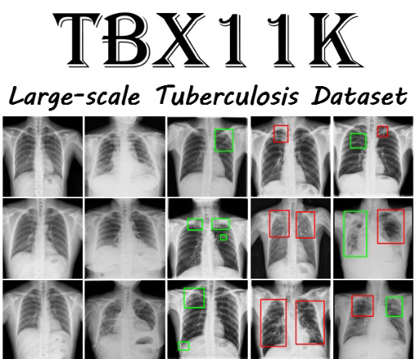

# Tbx11bb Bounding boxes

The TBX11K dataset is much larger, better annotated, and more realistic than existing TB datasets, enabling the training of deep CNNs.
X-rays are in the resolution of about 3000 × 3000. However, the original 3000 × 3000 images will lead to a storage size of over 100GB, which is too large to deliver. On the other hand, the Authors found that the resolution of 512 × 512 is enough to train deep models for TB detection and classification. In addition, it is almost impossible to directly use the 3000 × 3000 X-ray images for TB detection due to the limited receptive fields of the existing CNNs.
Original dataset with annotations can be found [here!](https://mmcheng.net/tb/) 

# Notebook
1. For Single image
2. For multiple images

py files
1. bb_single.py for single image
2. bb_mulitple.py for multiples images

## Original Paper
Liu, Y., Wu, Y. H., Ban, Y., Wang, H., & Cheng, M. M. (2020). Rethinking computer-aided tuberculosis diagnosis. In Proceedings of the IEEE/CVF Conference on Computer Vision and Pattern Recognition (pp. 2646-2655).
 
